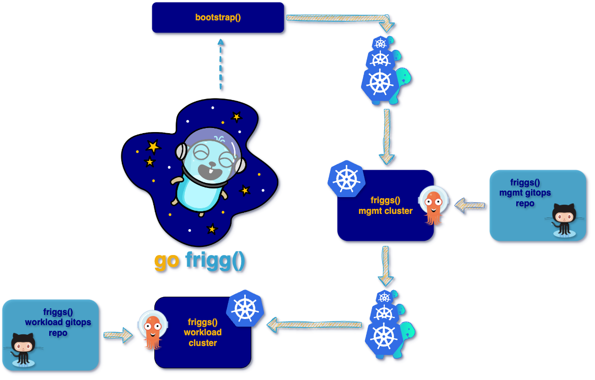

# Friggs Workload-Clusters GitOps Repository

## basement-deployments/

These Applications will be needed to provide a solid foundation of applications
for your workload clusters.

## app-deployments/

This folder will be your main entrypoint for all your other applications you wish 
to be deployed on your workload cluster.

We provided an example deployment.

## applicationsets-deployments/

If you wish to use ArgoCD Appsets feature: 
Add your YAMLs inside. 

You might want to take a look at the official documentation on how
to use the ArgoCD ApplicationSets.